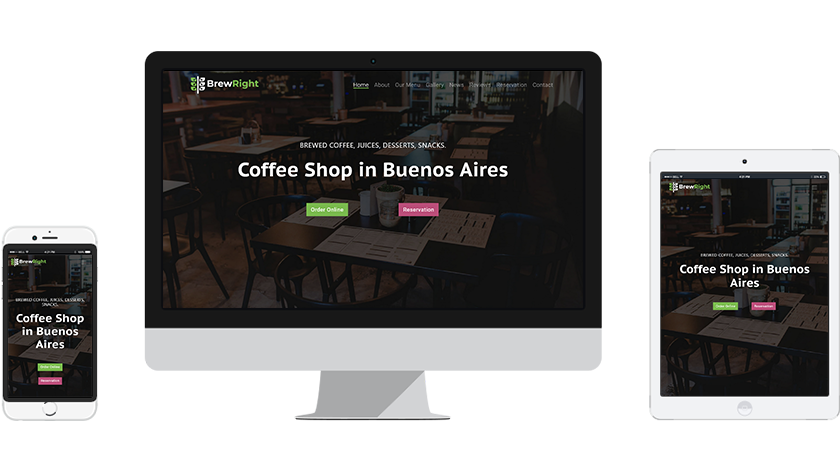

# Coffee Shop Website

## Table of contents

- [General info](#general-info)
- [Showcase](#showcase)
- [Technologies](#technologies)
- [Setup](#setup)
- [Status](#status)

## General info

I made this project to apply everything I'm learning about Bootstrap 5.

The site was written from scratch and the design was taken from [this template](https://demo.htmlhunters.com/profi/restaurant.html).   I have added and improved a few things to make it more visually appealing.

I had some trouble figuring out how to use Bootstrap at the start. 
When I create a website I always do it from a large screen to a smaller screen size. 
So I felt like I was doing things backward.  
With Bootstrap you start by assuming that you are with a single column
and then you divide it up.  
After reading the documentation, figuring this out it was really easy to get the layouts that I wanted.

What I like about Bootstrap: 
Faster development. It saved me a lot of time not having to write everything from scratch. 
The consistency. Everything feels structured. I found this a hard thing to do with other projects. 
Easy to customize. It was not hard to create my own custom classes. 
The responsiveness. Almost didn't have to use media-queries. 

What I dislike about Bootstrap: 
Not semantic. I feel like it gets a bit bloated with so many classes in a single div.

I'll create another project with Bootstrap4 to consolidate my knowledge.

## Showcase

## Technologies

- HTML
- CSS
- [SASS](https://github.com/sass/sass)
- Bootstrap 4
- [Start Bootstrap - Bare](https://github.com/StartBootstrap/startbootstrap-bare)
- [Bootstrap 4 DatePicker](https://gijgo.com/datepicker/example/bootstrap-4)
- [FontAwesome](https://fontawesome.com/)
- [AnimateOnScroll](https://michalsnik.github.io/aos/)
- JS

## Setup

- [Demo](https://vibrant-knuth-615579.netlify.app/)

## Status

Project is: _finished_