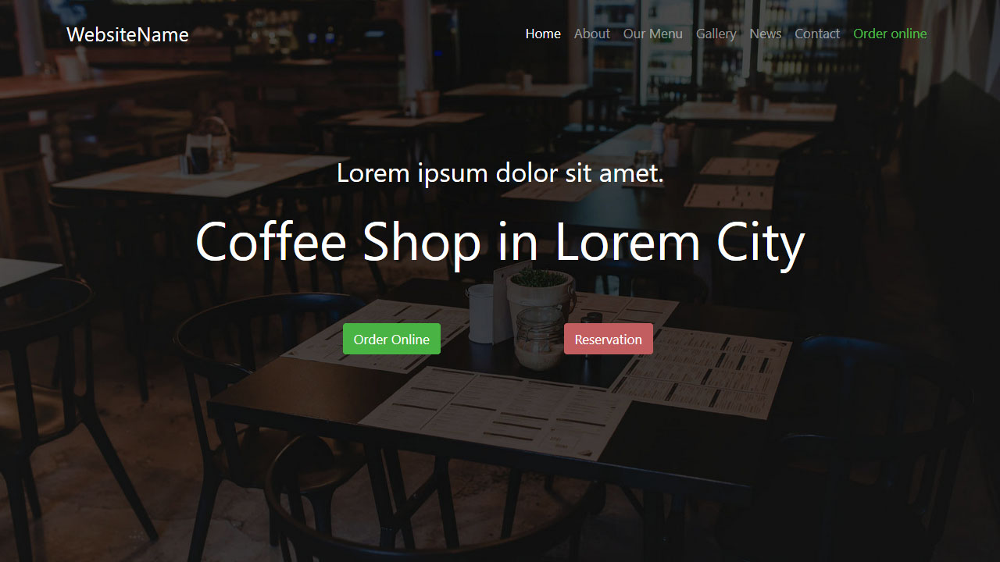

# Online Learning Website

## Table of contents

- [General info](#general-info)
- [Screenshots](#screenshot)
- [Technologies](#technologies)
- [Setup](#setup)
- [Status](#status)

## General info

I made this project to apply everything I'm learning about Bootstrap 4.

The site was written from scratch and the design was taken from [this template](https://demo.htmlhunters.com/profi/restaurant.html).   I have added and improved a few things to make it more visually appealing.

## Screenshot

## Technologies

- HTML
- CSS
- JS
- [Start Bootstrap - Bare](https://github.com/StartBootstrap/startbootstrap-bare)
- [FontAwesome](https://fontawesome.com/)
- [SASS](https://github.com/sass/sass)

## Setup

- [Demo](https://vibrant-knuth-615579.netlify.app/)

## Status

Project is: _in progress_